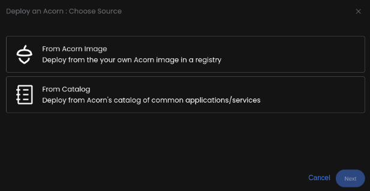

# Deploying Jellyfin on Acorn

[Jellyfin](https://jellyfin.org/) is the volunteer-built media solution that puts you in control of your media. Stream to any device from your own server, with no strings attached. Your media, your server, your way.

Jellyfin is a popular media server solution, valued for its open-source nature and robust features that empower users to manage and stream their media content seamlessly. When deployed on [Acorn](http://www.acorn.io) platform offering a generous free sandbox accessible to all through GitHub registration, Jellyfin gains distinct advantages. To deploy an application on Acorn we need to define our application as an [Acornfile](https://docs.acorn.io/reference/acornfile), which will produce the Acorn Image that we can deploy on the platform.  In this tutorial, we will explore how to provision a sample Jellyfin Server on Acorn.

If you want to skip to the end, just click [Run in Acorn](https://acorn.io/run/ghcr.io/infracloudio/jellyfin-acorn:v10.%23.%23-%23?ref=slayer321&name=jellyfin) to launch the app immediately in a free sandbox environment. All you need to join is a GitHub ID to create an account.

If you want to follow along, I’ll walk through the steps to deploy Jellyfin using Acorn.

_Note: Everything shown in this tutorial can be found in [this repository](https://github.com/infracloudio/jellyfin-acorn)_.


## Pre-requisites

- Acorn CLI: The CLI allows you to interact with the Acorn Runtime as well as Acorn to deploy and manage your applications. Refer to the [Installation documentation](https://docs.acorn.io/installation/installing) to install Acorn CLI for your environment.
- A GitHub account is required to sign up and use the Acorn Platform.

## Acorn Login
Login to the [Acorn Platform](http://beta.acorn.io) using the GitHub Sign-In option with your GitHub user.


After the installation of Acorn CLI for your OS, you can login to the Acorn platform.
```
$ acorn login beta.acorn.io
```


## Deploying the Jellyfin Application
In this tutorial we will deploy Jellyfin.

In the Acorn platform, there are two ways you can try this sample application.
1. Using Acorn platform dashboard.
2. Using CLI

The first way is the easiest one, where, in just a few clicks, you can deploy the jellyfin application on the platform and start using it. However, if you want to customize the application, use the second option.

## Deploying Using Acorn Dashboard

In this option you use the published Acorn application image to deploy the Jellyfin application in just a few clicks. It allows you to deploy your applications faster without any additional configurations. Let us see below how you can deploy Jellyfin app to the Acorn platform dashboard.

1. Log in to the [Acorn Platform](https://acorn.io/auth/login)  using the GitHub Sign-In option with your GitHub user.
2. Select the “Create Acorn” option.
3. Choose the source for deploying your Acorns
   3.1. Select “From Acorn Image” to deploy the sample Application.


   3.2. Provide a name "jellyfin”, use the default Region and provide the URL for the Acorn image and turn on the advanced option to provide the s3 bucket details where you have your media.
   ```
   ghcr.io/infracloudio/jellyfin-acorn:v10.#.#-#
   ```


_Note: The App will be deployed in the Acorn Sandbox Environment. As the App is provisioned on AcornPlatform in the sandbox environment it will only be available for 2 hrs and after that it will be shutdown. Upgrade to a pro account to keep it running longer_.

4. Once the Acorn is running, you can access it by clicking the Endpoint or the redirect link.
   4.1. Running Application on Acorn
   
   4.2. Running Jellyfin
   


## Deploying Using Acorn CLI
As mentioned previously, running the acorn application using CLI lets you understand the Acornfile. With the CLI option, you can customize the sample app to your requirement or use your Acorn knowledge to run your own Jellyfin application.

To run the application using CLI you first need to clone the source code repository on your machine.

```
$ git clone https://github.com/infracloudio/jellyfin-acorn.git
```
Once cloned here’s how the directory structure will look.

```
.
├── Acornfile
├── aws-config.sh
├── Dockerfile.bucketsync
├── Dockerfile.sidecar
├── jellyfin.svg
├── LICENSE
└── README.md
```

### Understanding the Acornfile

We have the Jellyfin Application ready. Now to run the application we need an Acornfile which describes the whole application without all of the boilerplate of Kubernetes YAML files. The Acorn CLI is used to build, deploy, and operate Acorn on the Acorn cloud platform.  It also can work on any Kubernetes cluster running the open source Acorn Runtime. 

Below is the Acornfile for deploying the Jellyfin app that we created earlier:

```
args: {
    storage:     "2G"
    ...
    bucket_name: ""
}

containers: {
    jellyfin: {
        image: "jellyfin/jellyfin:10.8.13"
        ports: publish: "8096:8096/http"
        env: {
            JELLYFIN_PublishedServerUrl: "@{services.jellyfin.endpoint}"
        }
        if args.bucket_name != "" {
        sidecars: {
            stagedata: {
            init: true
            env: {
                AWS_ACCESS_KEY_ID:     args.access_key
                AWS_SECRET_ACCESS_KEY: args.secret_key
                AWS_S3_BUCKET:         args.bucket_name
            }
            image: "ghcr.io/infracloudio/jellyfin-sidecar:v0.0.1"
            dirs: {
                "/aws-config.sh": "./aws-config.sh"
                "/jellyfinmedia": "volume://jellyfinmedia"
                }
            }
        }
        }
        dirs: {
            "/config":        "volume://jellyfinconfig?subpath=config"
            "/cache":         "volume://jellyfinconfig?subpath=cache"
            "/jellyfinmedia": "volume://jellyfinmedia"
        }
    }
    if args.bucket_name != "" {
        bucketsync: {
            image: "ghcr.io/infracloudio/jellyfin-bucketsync:v0.0.2"
            env: {
                AWS_ACCESS_KEY_ID:     args.access_key
                AWS_SECRET_ACCESS_KEY: args.secret_key
                AWS_S3_BUCKET:         args.bucket_name
                CRONTAB_STATUS:        "true"
            }
            dirs: {
                "/aws-config.sh": "./aws-config.sh"
                "/jellyfinmedia": "volume://jellyfinmedia"
            }
        }
    }
}

volumes: {
    jellyfinconfig: {}
    jellyfinmedia: {size: args.storage}
}
```


There are 2 requirements for running jellyfin Application
- Jellyfin Application
- s3bucketsync

The above Acornfile has the following elements:

- **Args**: Which is used to take the user args.
- **Containers**:  We define different containers with following configurations:
   - **jellyfin**: 
       - **image**: using jellyfin image
       - **ports**:  port where our jellyfin application is listening on.
       - **env**:  In the env section we are providing all the env variables which the application will be using.
       - **dirs**: this field is used to mount our application to a specific directory.
       - **sidecars**: using sidecar we are configuring the s3 bucket
   - **bucketsync**: 
       - **image**: using aws cli image to sync bucket
       - **env**:  In the env section we are providing all the env variables which the application will be using.
       - **dirs**: this field is used to mount our application to a specific directory.
- **Volumes**: Volmes which we are referring inside the containers dirs field


### Running the Application
We have already logged in using Acorn CLI now you can directly deploy applications on your sandbox on the Acorn platform. Run the following command from the root of the directory.

```
$ acorn run -n jellyfin . --access_key <>  --bucket_name <> --secret_key <>
```

Below is what the output looks like.


## Jellyfin Application

In this tutorial till now we show how we can deploy our jellyfin server with our media content on s3 bucket by providing all the details. 

Once we provide all the login details and when selecting the folder select it as `/jellyfinmedia` as that's where we have copied the s3 media. Below is what our jellyfin dashboard looks like once we have everything running.You can see all the four photos that I have on s3 bucket.


If you are looking to host your local media to jellyfin you just need to make some minor changes to acornfile and run it using acorn cli from your local system.You need to remove two fields, first is the whole `sidecars` field and then the `bucketsync` field inside the current acornfile.Now replace the `/jellyfinmedia` field with your local directory. Currently if looks like `"/jellyfinmedia": "volume://jellyfinmedia"` change it to `"/jellyfinmedia": "./your/localmedia/path"`.


## What's Next?

1. The App is provisioned on Acorn Platform and is available for two hours. Upgrade to Pro account for anything you want to keep running longer.
2. After deploying you can edit the Acorn Application or remove it if no longer needed. Click the Edit option to edit your Acorn's Image. Toggle the Advanced Options switch for additional edit options.
3. Remove the Acorn by selecting the Remove option from your Acorn dashboard.

## Conclusion
In this tutorial we show how we can use the Acornfile and get our Jellyfin server up and running.


